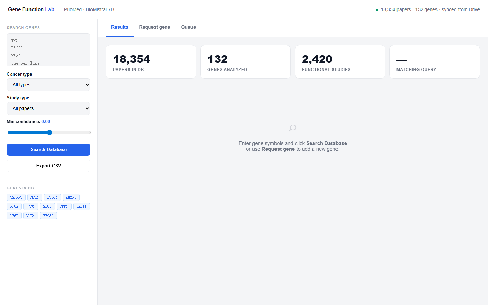
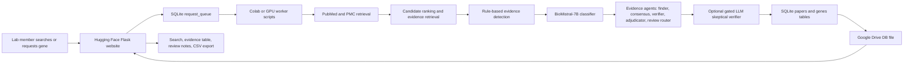
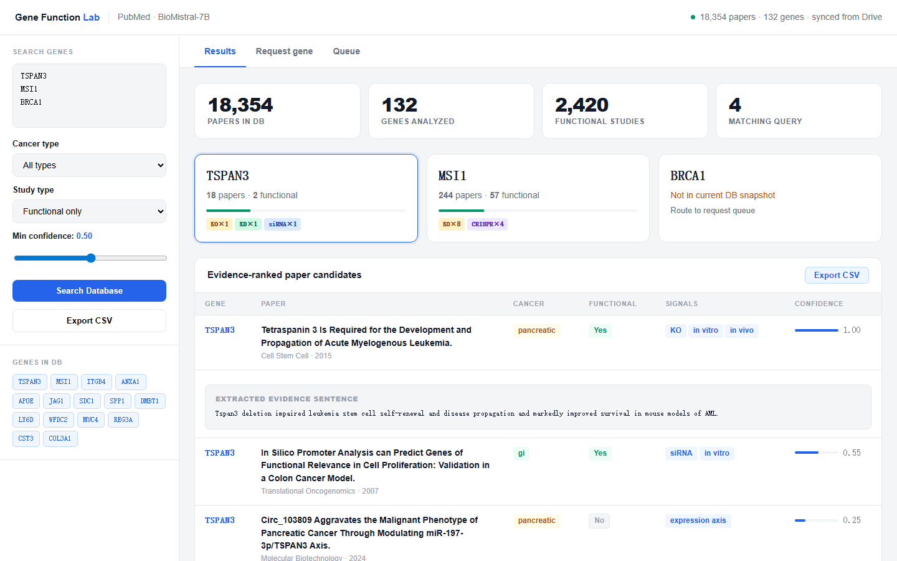
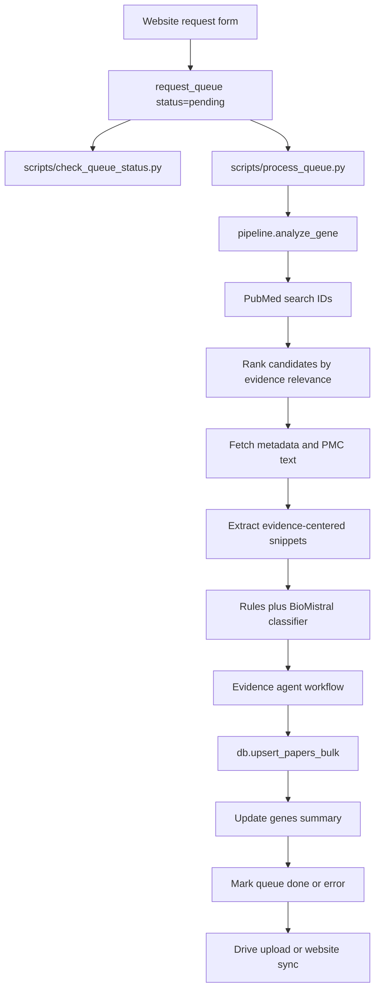

# PubMed LLM Evidence Extraction

Evidence-grounded biomedical literature extraction for functional cancer gene analysis.

This repository supports a lab workflow for finding and reviewing PubMed papers that may contain functional evidence for cancer-related genes. Lab members use a Hugging Face website to search existing results or request new genes. A separate GPU worker retrieves PubMed/PMC records, applies biomedical rules plus one LLM classifier, optionally runs a gated LLM skeptical verifier for risky papers, writes structured evidence into SQLite, and syncs the database back to the website.

The project is intentionally practical: it is a maintainable evidence triage system, not a generic RAG product, not an open-ended autonomous agent platform, and not clinical decision support.



## Current System In One Page



The hosted website is CPU-only. The BioMistral model runs in Colab or another GPU environment.

## What It Does

The current version combines rule-based evidence detection with an LLM classifier to identify candidate functional evidence from biomedical papers. For each gene/paper pair, the system stores:

- PubMed metadata: PMID, title, journal, year, DOI, links
- cancer context and study-type signals
- candidate functional-study label
- in vitro / in vivo evidence signals
- perturbation signals such as knockout, knockdown, siRNA, shRNA, CRISPR, and CRISPR screen
- extracted evidence snippets
- best gene-linked evidence quote and direct gene-linked evidence count
- deterministic paper-type label for review/prognosis/expression/methods triage
- search-relevance and evidence-retrieval diagnostics
- LLM/rule disagreement diagnostics
- evidence-agent verification status, optional LLM verifier result, adjudicator result, review recommendation, and agent trace
- an evidence-support confidence score
- human review status, label, reviewer notes, and reviewer timestamp

The confidence score is not a calibrated probability and is not a probability returned by BioMistral. It is an interpretable evidence-support score used to prioritize review. The website labels rows as weak, moderate, or strong support and highlights cases that need human attention.



## Why This Exists

Functional cancer gene review is slow because papers can describe many different kinds of evidence: expression changes, association studies, pathway mentions, perturbation experiments, screens, animal models, reviews, and clinical correlations. This project helps reviewers separate likely functional studies from weaker or indirect evidence so expert review time is spent on the most useful papers first.

Primary users:

- lab members searching gene-level evidence
- maintainers processing requested genes
- researchers reviewing and labeling candidate papers
- future contributors improving the extraction pipeline

## Website Features

Existing website features:

- search one or more genes
- filter by cancer type, study type, review status, and minimum confidence
- view per-gene summary cards
- inspect evidence-ranked papers
- expand rows to see review signals and diagnostics
- save human review status, label, and notes
- export CSV results
- request new genes
- inspect recent queue entries

The live Space is password protected. Store the password in the Hugging Face `APP_PASSWORD` secret. Do not commit passwords or screenshots containing credentials.

## Backend Workflow

Gene requests and maintenance are handled by scripts rather than manually editing notebook code.



Monthly refresh now uses the same maintenance entry point. `scripts/process_queue.py`
processes pending queue requests first, then refreshes existing genes whose
`genes.last_run_at` is older than the configured interval or fixed cutoff date.

## Repository Structure

| Path | Purpose |
| --- | --- |
| `app.py` | Flask application for the Hugging Face Space. |
| `templates/index.html` | Browser UI for search, queue, and human review. |
| `db.py` | SQLite schema, migrations, queries, queue helpers, review helpers, export helpers. |
| `drive_sync.py` | Google Drive download/upload logic for the website DB. |
| `confidence.py` | Shared evidence-support scoring rubric used by both new processing and score recomputation. |
| `evidence_agents.py` | Role-specific evidence agents: evidence finder, classifier consensus, skeptical verifier, adjudicator, and review router. |
| `evidence_verifier.py` | Deterministic verifier used by the agent workflow and confidence scoring. |
| `paper_type.py` | Lightweight deterministic paper-type classifier for review/prognosis/expression/methods triage. |
| `pipeline.py` | PubMed/PMC retrieval, rules, evidence extraction, BioMistral classification, scoring. |
| `scripts/check_queue_status.py` | Prints DB and queue counts. |
| `scripts/process_queue.py` | Main maintenance worker for pending requests, failed requests, and stale existing-gene refresh. |
| `scripts/recompute_confidence.py` | Recomputes existing paper evidence-support scores after scoring logic changes, without rerunning PubMed or BioMistral. |
| `scripts/reprocess_papers.py` | Force-reprocesses a gene or selected PMIDs with the current search/evidence/classifier pipeline. |
| `scripts/evaluate_gold_labels.py` | Evaluates DB labels against a small human-labeled CSV benchmark. |
| `scripts/update_existing_genes.py` | Advanced fallback for manual existing-gene refresh chunks. |
| `scripts/check_gene_refresh.py` | Advanced fallback verification for manual refresh chunks. |
| `scripts/common.py` | Shared script configuration, logging, DB path, cache path, and upload helpers. |
| `pubmed_llm_maintenance_runner.ipynb` | Recommended Colab notebook for non-coding maintainers. |
| `README_FOR_DRIVE.md` | Start-here handoff guide for the Google Drive working folder. |
| `archive/notebooks/pubmed_llm_legacy_2026-05.ipynb` | Older notebook kept only for historical reference. |
| `requirements.txt` | Lightweight website dependencies. |
| `requirements-worker.txt` | Worker/GPU dependencies. |
| `docs/` | Maintenance, deployment, monthly refresh, and system documentation. |
| `docs/drive-cleanup.md` | Checklist for keeping the Drive workspace navigable. |
| `docs/images/` | README/demo visuals. |
| `gene_function_lab/gene_function_lab.db` | Local DB snapshot. Do not treat this as a secret, but avoid unnecessary commits. |

The project is still intentionally flat because Hugging Face Spaces expects the app files at the repository root. A future larger refactor could move code into `app/` and `pipeline/`, but that should be done only after deployment paths are tested.

## Setup

### Python

Recommended:

- Python 3.10 or 3.11 for local website work
- Colab or a GPU machine for BioMistral inference

Website dependencies:

```bash
pip install -r requirements.txt
```

Worker dependencies:

```bash
pip install -r requirements-worker.txt
```

### Environment Variables

Copy `.env.example` for local reference, but do not commit real secrets.

| Variable | Used By | Purpose |
| --- | --- | --- |
| `GENE_LAB_DB_PATH` | website, scripts | SQLite DB path. |
| `GDRIVE_CACHE` | worker | PubMed/PMC cache directory. |
| `ENTREZ_EMAIL` | worker | NCBI Entrez contact email. |
| `HF_TOKEN` | worker | Hugging Face token for model downloads. |
| `USE_AGENTIC_VERIFIER` | worker | Optional second-pass LLM verifier for risky papers. Default `true`. |
| `AGENTIC_MODE` | worker | Verifier mode: `borderline`, `functional`, `all`, or `off`. |
| `MAX_VERIFIER_CALLS` | worker | Max LLM verifier calls per gene run. Default `8`. |
| `VERIFIER_ONLY_BORDERLINE` | worker | Keep verifier focused on risky rows. Default `true`. |
| `GOOGLE_SERVICE_ACCOUNT_JSON` | website, upload scripts | Google service-account JSON content. |
| `GOOGLE_DRIVE_DB_FILE_ID` | website, upload scripts | Exact Drive file id for the shared DB. Strongly recommended. |
| `GOOGLE_DRIVE_FOLDER_ID` | website, upload scripts | Optional folder scope for Drive lookup. |
| `APP_PASSWORD` | website | Private website password. |

### Hugging Face Space

The Space should include:

- `app.py`
- `db.py`
- `drive_sync.py`
- `Dockerfile`
- `requirements.txt`
- `templates/index.html`

Set Space secrets:

- `APP_PASSWORD`
- `GOOGLE_SERVICE_ACCOUNT_JSON`
- `GOOGLE_DRIVE_DB_FILE_ID`

The Flask app serves `templates/index.html`. Do not upload a root-level `index.html` as a replacement for the app UI.

### Colab Maintenance

For routine lab work, open:

```text
pubmed_llm_maintenance_runner.ipynb
```

Run setup, edit the small settings cell, then run only the task cell you need.

## Maintenance Quick Reference

Check database and queue status:

```bash
python -u scripts/check_queue_status.py \
  --db-path /content/drive/MyDrive/pubmed_llm/gene_function_lab/gene_function_lab.db
```

Run the main maintenance workflow. This processes queue rows first, then
refreshes existing genes whose `last_run_at` is older than the configured
cutoff:

```bash
python -u scripts/process_queue.py \
  --db-path /content/drive/MyDrive/pubmed_llm/gene_function_lab/gene_function_lab.db \
  --cache-dir /content/drive/MyDrive/pubmed_llm/functional_study_cache \
  --max-requests 5 \
  --max-papers 300 \
  --retry-errors \
  --reset-processing \
  --refresh-stale \
  --update-interval-days 30 \
  --max-refresh-genes 15 \
  --refresh-max-papers 300 \
  --upload-at-end
```

To finish a paused monthly campaign, use a fixed cutoff date. For example, this
continues genes not refreshed since June 8, 2026:

```bash
python -u scripts/process_queue.py \
  --db-path /content/drive/MyDrive/pubmed_llm/gene_function_lab/gene_function_lab.db \
  --cache-dir /content/drive/MyDrive/pubmed_llm/functional_study_cache \
  --max-requests 5 \
  --max-papers 300 \
  --retry-errors \
  --reset-processing \
  --refresh-stale \
  --refresh-before 2026-06-08 \
  --max-refresh-genes 15 \
  --refresh-max-papers 300 \
  --upload-at-end
```

The older monthly-refresh script remains available for manual chunk control:

```bash
python -u scripts/update_existing_genes.py \
  --db-path /content/drive/MyDrive/pubmed_llm/gene_function_lab/gene_function_lab.db \
  --cache-dir /content/drive/MyDrive/pubmed_llm/functional_study_cache \
  --start-at 0 \
  --max-genes 15 \
  --max-papers 500 \
  --upload
```

Verify that same chunk:

```bash
python -u scripts/check_gene_refresh.py \
  --db-path /content/drive/MyDrive/pubmed_llm/gene_function_lab/gene_function_lab.db \
  --start-at 0 \
  --max-genes 15
```

After updating the Drive DB, refresh the website from the authenticated Space UI or call the sync endpoint from the Space domain. Treat any URL token as private.

Full guides:

- [System overview](docs/system-overview.md)
- [Pipeline details](docs/pipeline.md)
- [Pipeline algorithm](docs/pipeline_algorithm.md)
- [Confidence metric](docs/confidence_metric.md)
- [Accuracy improvements](docs/accuracy_improvements.md)
- [Human review dataset](docs/human_review_dataset.md)
- [Reprocess workflow](docs/reprocess_workflow.md)
- [Maintenance guide](docs/maintenance.md)
- [Monthly refresh guide](docs/monthly-refresh.md)
- [Deployment guide](docs/deployment.md)
- [Maintenance pipeline audit](docs/maintenance-pipeline.md)

## Troubleshooting

| Symptom | Likely Cause | Fix |
| --- | --- | --- |
| Website shows `0 papers` or `synced error` | DB sync failed or schema migration did not run | Check Space logs, confirm `GOOGLE_SERVICE_ACCOUNT_JSON` and `GOOGLE_DRIVE_DB_FILE_ID`, restart after code update. |
| Website counts stay old after Colab finishes | Website is reading a different Drive DB file | Set the exact `GOOGLE_DRIVE_DB_FILE_ID` in both Colab and Space secrets. |
| Colab output appears frozen | Python output buffering or long BioMistral inference | Use `python -u`; the maintenance runner streams output line by line. |
| `GOOGLE_SERVICE_ACCOUNT_JSON secret not set` | Upload secret is missing in Colab | Mounted Drive writes may still update the DB, but API upload will fail. Add the secret or manually replace the Drive DB. |
| BioMistral downloads every run | Runtime cache is temporary or HF token missing | Keep cache on Drive where possible and set `HF_TOKEN`. |
| PubMed error about `retstart` | Query returns too many results | Lower `max_papers`, rely on newer/ranked results, or refine PubMed query logic later. |
| Queue rows stuck as `processing` | Colab was interrupted | Run `process_queue.py --reset-processing --max-requests 0`. |
| Human review saves locally but not to Drive | Space cannot upload DB | Configure Drive write secret or manually preserve/upload DB before Space restart. |

## Current Limitations

- Processing is slow because each paper can require PubMed lookup, PMC fetch, rule extraction, and LLM inference.
- Colab is workable for maintenance but not ideal as a production worker.
- The confidence score is evidence-support, not a validated probability. It now
  includes a deterministic skeptical verifier that checks whether the extracted
  snippets support direct gene perturbation, phenotype evidence, gene-specific
  matching, paper type, direct gene-linked evidence, and rule/LLM agreement.
- The system is not guaranteed to retrieve every relevant paper, although the
  search now prioritizes evidence-focused candidates before the broad fallback.
- Human review labels are stored in SQLite and require careful DB sync/backup discipline.
- The pipeline has not yet been evaluated against a formal gold-label benchmark.

## Future Work

Highest-value future upgrades:

1. Create a small manually reviewed gold-label set.
2. Report precision, recall, F1, and disagreement cases.
3. Improve confidence calibration using reviewer feedback and a manually labeled
   benchmark set.
4. Move routine refresh from Colab to a scheduled GPU worker when the lab has stable compute.
5. Add lightweight CI checks for Python syntax, schema migration, and secret scanning.

The next AI step should be evidence-grounded verification and human review routing, not a generic vector-database RAG rewrite.
