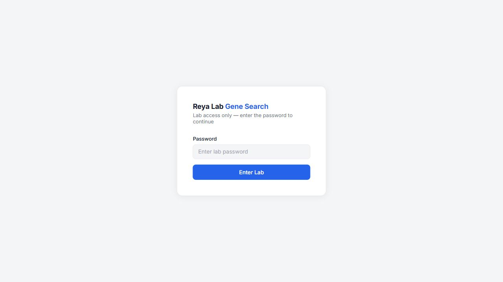
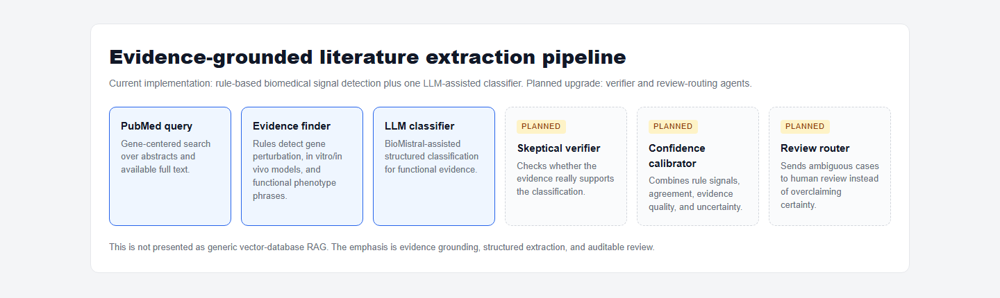
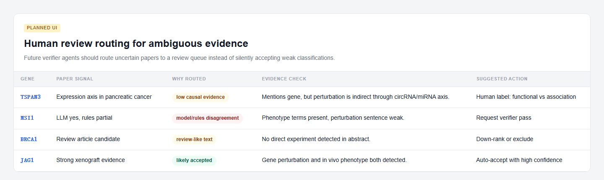

# PubMed LLM Evidence Extraction

Evidence-grounded biomedical literature extraction for functional cancer gene analysis.

This project helps a research team search PubMed-derived literature for papers that may contain functional evidence about cancer-related genes. The current version combines rule-based biomedical signal detection with one LLM-assisted classifier to identify candidate evidence from abstracts and available full text, then stores structured results in a searchable SQLite database and review website.

It is not a generic vector-database RAG system, not a fully autonomous agent platform, and not clinical decision support. The goal is to make literature review faster, more auditable, and easier to prioritize for human scientific review.


## Why This Matters

Functional cancer gene review is slow because relevant papers often describe different experimental systems, perturbation methods, phenotype assays, and cancer contexts. A gene may appear in expression-only studies, review papers, prognostic association papers, CRISPR screens, xenografts, or direct mechanistic experiments. These categories matter scientifically, but they are hard to triage manually at scale.

This repository turns those papers into structured evidence records:

- gene and PMID
- cancer type
- functional study yes/no candidate label
- in vitro and in vivo signals
- perturbation method signals such as knockout, knockdown, siRNA, shRNA, CRISPR, and CRISPR screens
- extracted evidence sentences
- confidence score and LLM/rule agreement signals
- queue state for genes requested through the web UI

## Current Technical Approach

The current pipeline is best described as evidence-grounded extraction plus classification:

1. **PubMed retrieval**
   `pipeline.py` searches PubMed for a target gene and cancer/function-related terms, then fetches metadata and available full text from PMC when possible.

2. **Rule-based biomedical signal detection**
   Regular expressions and domain-specific keyword logic detect perturbation methods, experimental systems, phenotype language, cancer context, and review/association-like patterns.

3. **Evidence sentence extraction**
   Candidate evidence sentences are selected from abstracts/full text around gene mentions and functional-study signals.

4. **LLM-assisted classification**
   BioMistral-7B is used in the Colab/GPU worker to classify evidence into a structured JSON-like output. The Hugging Face website does not load the model.

5. **Evidence-support scoring**
   The current confidence field is an interpretable evidence-support score based on perturbation evidence, phenotype evidence, evidence depth, LLM/rule agreement, and penalties for weak evidence patterns. This is useful for ranking candidates, but it should not be interpreted as a calibrated probability yet.

6. **Database and review UI**
   Results are written into SQLite and served through a Flask website on Hugging Face Spaces.


## What The Website Shows

The web UI is designed for fast research review:

- search one or more genes
- filter by cancer type, functional label, and minimum confidence
- inspect evidence-ranked papers
- view extracted evidence snippets
- export CSV results
- request new genes for later Colab processing
- inspect the request queue

The live Hugging Face Space is password protected. The public hosted view currently exposes the login screen:



The demo screenshots in this repository are generated from the same UI style and local database snapshot so the GitHub presentation can show the intended review workflow without exposing private access credentials.

## Architecture

```text
Researcher / Lab member
  -> Hugging Face Spaces Flask website
  -> SQLite DB snapshot synced from Google Drive

Monthly or on-demand maintenance
  -> Google Colab notebook with GPU
  -> PubMed + PMC retrieval
  -> rule-based evidence detection
  -> BioMistral-7B classifier
  -> SQLite DB update
  -> Google Drive / website sync
```

The separation is intentional:

- **Hugging Face Spaces** serves the CPU-only review website.
- **Google Colab** runs the heavier GPU model workflow.
- **Google Drive** acts as the shared DB handoff between Colab and the hosted site.
- **GitHub** stores source code, documentation, and a database snapshot for reproducibility.

## Planned AI Upgrade: Evidence-Grounded Agents

The best next AI upgrade is not generic vector RAG. The more appropriate direction is an evidence-grounded multi-step review pipeline:

```text
PubMed Paper
  -> Evidence Finder Agent
  -> Functional Study Classifier
  -> Skeptical Verifier Agent
  -> Confidence Calibrator
  -> Human Review Router
  -> Database / Review UI
```



### Why This Direction

A vector database can help retrieve semantically similar text, but the core scientific risk here is different: the system must avoid treating weak association, expression-only findings, review text, or indirect pathway mentions as direct functional evidence.

The next version should therefore focus on:

- **Evidence Finder Agent**
  Selects passages that mention the target gene near perturbation, model-system, and phenotype terms.

- **Functional Study Classifier**
  Produces a structured label from the evidence passage, not from the whole paper in an unconstrained way.

- **Skeptical Verifier Agent**
  Challenges the initial label by asking whether the evidence actually supports the claim.

- **Confidence Calibrator**
  Separates sub-scores such as gene specificity, perturbation strength, experimental system quality, LLM/rule agreement, and evidence completeness.

- **Human Review Router**
  Sends ambiguous cases to review instead of forcing a confident answer.



## What This Project Does Not Claim

This repository should be read as a research workflow prototype, not a validated biomedical product.

It does not currently provide:

- production-grade RAG over all PubMed
- autonomous end-to-end scientific agents
- validated clinical recommendations
- comprehensive recall over every relevant paper
- calibrated probabilities of gene function
- replacement for expert review

The intended use is triage and evidence organization for researchers.

## Repository Layout

| Path | Purpose |
| --- | --- |
| `app.py` | Flask web app for the Hugging Face Space. CPU only. |
| `templates/index.html` | Search/review UI. |
| `db.py` | SQLite schema, query helpers, exports, and request queue logic. |
| `drive_sync.py` | Google Drive sync for the hosted DB. |
| `pipeline.py` | PubMed retrieval, evidence extraction, rule logic, LLM classification, confidence scoring. |
| `pubmed_llm_maintenance_runner.ipynb` | Recommended Colab maintenance notebook with simple settings and task cells. |
| `pubmed_llm.ipynb` | Original Colab worker notebook kept for reference/backward compatibility. |
| `scripts/process_queue.py` | Batch worker for pending website gene requests. |
| `scripts/update_existing_genes.py` | Monthly refresh script for genes already in the database. |
| `scripts/check_queue_status.py` | Lightweight queue/database status check. |
| `gene_function_lab/gene_function_lab.db` | Current local SQLite database snapshot. |
| `Dockerfile` | Hugging Face Spaces container setup. |
| `requirements.txt` | CPU website dependencies. |
| `requirements-worker.txt` | GPU/worker dependencies for Colab or a GPU VM. |
| `docs/images/` | README screenshots and roadmap visuals. |

Generated cache folders, CSV exports, Python bytecode, and credential JSON files are excluded through `.gitignore`.

## Maintenance Workflow

The notebook remains available, but the preferred maintenance path is now the reusable scripts in `scripts/`.

For non-coding lab members, open `pubmed_llm_maintenance_runner.ipynb` in Colab, run setup, edit the small settings cell, then run the task cell for queue processing, error retries, or monthly refresh.

Check queue/database status:

```bash
python scripts/check_queue_status.py \
  --db-path /content/drive/MyDrive/pubmed_llm/gene_function_lab/gene_function_lab.db
```

Process a safe first batch of queued genes:

```bash
python scripts/process_queue.py \
  --db-path /content/drive/MyDrive/pubmed_llm/gene_function_lab/gene_function_lab.db \
  --cache-dir /content/drive/MyDrive/pubmed_llm/functional_study_cache \
  --max-requests 1 \
  --max-papers 25 \
  --reset-processing \
  --upload-at-end
```

Refresh existing genes monthly:

```bash
python scripts/update_existing_genes.py \
  --db-path /content/drive/MyDrive/pubmed_llm/gene_function_lab/gene_function_lab.db \
  --cache-dir /content/drive/MyDrive/pubmed_llm/functional_study_cache \
  --start-at 0 \
  --max-genes 5 \
  --max-papers 50 \
  --upload
```

See [docs/maintenance.md](docs/maintenance.md) for the full operational guide, backlog strategy, and troubleshooting notes.

The website itself should remain lightweight. Do not run BioMistral inside the Hugging Face CPU Space.

## Setup Notes

### Hugging Face Spaces

Create a Docker Space and include:

- `app.py`
- `db.py`
- `drive_sync.py`
- `Dockerfile`
- `requirements.txt`
- `templates/index.html`

Required repository secret:

- `GOOGLE_SERVICE_ACCOUNT_JSON`

Optional repository secret:

- `APP_PASSWORD`

### Google Colab

Use `pubmed_llm.ipynb` for GPU work. Replace placeholder secrets with Colab secrets or private Drive files:

- Hugging Face token
- Google service-account JSON
- PubMed/Entrez email

Do not commit real service-account JSON files, Hugging Face tokens, or `.env` files.

For script-based maintenance in Colab:

```bash
%cd /content/drive/MyDrive/pubmed_llm
!pip install -r requirements-worker.txt
```

## Future Engineering Priorities

High-value next steps:

1. Add a small manually reviewed gold-label set.
2. Report precision, recall, F1, and disagreement cases.
3. Display interpretable confidence sub-signals in the review UI.
4. Add a verifier pass for low-confidence or rule/LLM-disagreement cases.
5. Add a review-needed table to the website.
6. Track reviewer corrections and use them for active learning.
7. Add scheduled GitHub Actions for syntax checks and notebook secret scanning.

## Limitations

The pipeline depends on PubMed/PMC availability, text extraction quality, keyword coverage, prompt stability, and model behavior. It may miss relevant evidence or over-rank weak evidence. Human review is expected before drawing scientific conclusions.

## Security

This repository previously contained private credentials during local handoff and has since been cleaned. Any exposed service-account keys or Hugging Face tokens should be revoked and rotated before public sharing.
