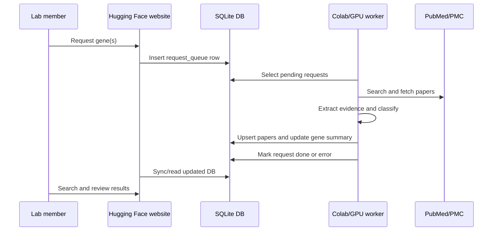
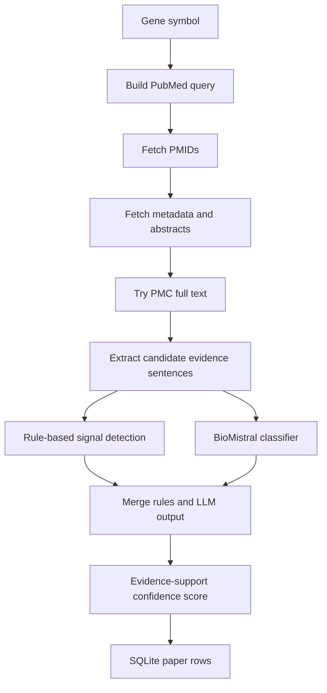
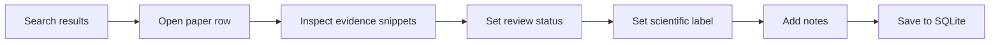

# System Overview

This document explains how the whole project works from request to website display.

## Purpose

The project helps researchers triage biomedical literature for functional cancer gene evidence. It searches PubMed/PMC, detects experimental evidence signals, applies one LLM-assisted classifier, stores structured records in SQLite, and exposes the results through a Hugging Face web interface.

It is not a clinical product and not a full PubMed-scale RAG system.

## Components

| Component | Runtime | Files | Responsibility |
| --- | --- | --- | --- |
| Website | Hugging Face Space CPU container | `app.py`, `templates/index.html`, `db.py`, `drive_sync.py` | Search UI, gene requests, queue view, review labels, CSV export, Drive DB sync. |
| Database | SQLite file on Google Drive | `gene_function_lab/gene_function_lab.db` | Shared source of truth for papers, genes, request queue, and human review fields. |
| Worker | Colab GPU or GPU VM | `pipeline.py`, `scripts/*.py`, `requirements-worker.txt` | PubMed/PMC retrieval, evidence extraction, LLM classification, DB writes. |
| Maintenance notebook | Colab | `pubmed_llm_maintenance_runner.ipynb` | Low-code interface for lab members to run common maintenance tasks. |
| Documentation | GitHub | `README.md`, `docs/*.md` | Transfer knowledge for future maintainers. |

## Request And Processing Flow



## Main Database Tables

| Table | Purpose |
| --- | --- |
| `papers` | One row per `(gene, pmid)` evidence record. Includes metadata, evidence signals, confidence, and human review fields. |
| `genes` | One row per processed gene. Stores summary counts and last run time. |
| `request_queue` | Gene requests submitted from the website. Status is `pending`, `processing`, `done`, or `error`. |
| `skipped_pmids` | PMIDs intentionally skipped for a gene, usually because they were not cancer-related. |

## Evidence Pipeline



The rules detect perturbation methods, model systems, phenotype language, and weak-evidence patterns. The LLM is used as a constrained classifier, not as a free-form answer generator.

## Human Review Flow



Review fields are part of the same DB file. Because the Hugging Face Space filesystem is temporary, review writes should be synced or the Drive DB should be replaced before restarting the Space.

## Manual Steps That Still Exist

- A lab member must run the Colab/GPU worker to process new queue requests.
- Monthly refresh is run in chunks by changing `START_AT` and `MAX_GENES`.
- Website deployment updates still require uploading/pushing the changed app files to the Hugging Face Space.
- Drive credentials and Space passwords are managed manually through private secrets.

## Recommended Future Structure

The repository currently stays flat to avoid breaking Hugging Face deployment. If the project grows, a safer future structure would be:

```text
app/
  app.py
  templates/
pipeline/
  retrieval.py
  evidence.py
  classifier.py
  scoring.py
scripts/
notebooks/
docs/
assets/
```

Only do this after adding deployment tests or a clear migration plan.
